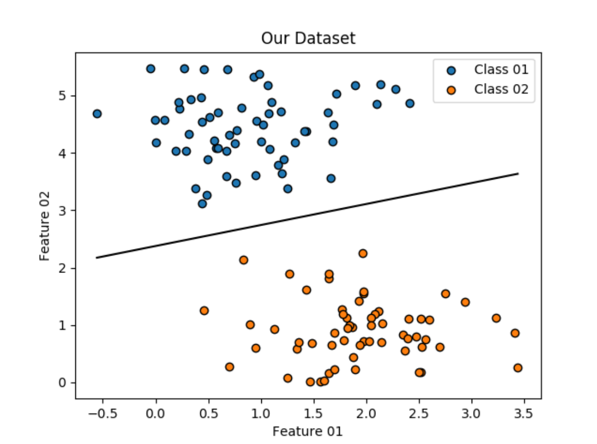

# Simple-Linear-SVM-Algorithm

### Abstract
Support Vector Machine or SVM is one of the most popular Supervised Learning algorithms, which is used for Classification as well as Regression problems. However, primarily, it is used for Classification problems in Machine Learning. The goal of the SVM algorithm is to create the best line or decision boundary that can segregate n-dimensional space into classes so that we can easily put the new data point in the correct category in the future. This best decision boundary is called a hyperplane. Here is an example of how this algorithm works:

#### To use this work on your researches or projects you need:
* Python 3.7.0
* Python packages:
	* matplotlib
	* numpy
	* scikit_learn
#

#### To install Python:
_First, check if you already have it installed or not_.
~~~~
python3 --version
~~~~
_If you don't have python 3 in your computer you can use the code below_:
~~~~
sudo apt-get update
sudo apt-get install python3
~~~~
#

#### To install packages via pip install:
~~~~
sudo pip3 install matplotlib numpy scikit_learn
~~~~
_If you haven't installed pip, you can use the codes below in your terminal_:
~~~~
sudo apt-get update
sudo apt install python3-pip
~~~~
_You should check and update your pip_:
~~~~
pip3 install --upgrade pip
~~~~
#

